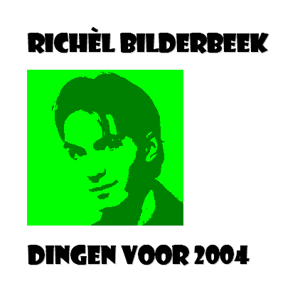

# CD #2: Dingen Voor 2004

My first solo release and a terrible recording. Most songs start with me
walking from the soundtable to the piano.

 * [Download the complete CD 'Dingen Voor 2004' (zip)](CD02_All.zip)
 * [View the booklet of 'Dingen voor 2004'](CD02_Booklet.doc)

Title | OGG | MP3
---|---|---
01. [Al Heb Je Blauw Haar](https://github.com/richelbilderbeek/music/blob/master/AlHebJeBlauwHaar.md) | [here](CD02_01AlHebJeBlauwHaar.ogg) | [here](CD02_01AlHebJeBlauwHaar.mp3)
02. [Come Home Darling](https://github.com/richelbilderbeek/music/blob/master/ComeHomeDarling.md) | [here](CD02_02ComeHomeDarling.ogg) | [here](CD02_02ComeHomeDarling.mp3)
03. Eerste Signaal | [here](CD02_03EersteSignaal.ogg) | [here](CD02_03EersteSignaal.mp3)
04. [Het Koffielied](https://github.com/richelbilderbeek/music/blob/master/HetKoffielied.md) | [here](CD02_04HetKoffielied.ogg) | [here](CD02_04HetKoffielied.mp3)
05. [Het Leven Is Naar](https://github.com/richelbilderbeek/music/blob/master/HetLevenIsNaar.md) | [here](CD02_05HetLevenIsNaar.ogg) | [here](CD02_05HetLevenIsNaar.mp3)
06. [Het N..kmenslied](https://github.com/richelbilderbeek/music/blob/master/HetNeukmenslied.md) | [here](CD02_06HetNeukmenslied.ogg) | [here](CD02_06HetNeukmenslied.mp3)
07. Russisch Liedje | [here](CD02_07RussischLiedje.ogg) | [here](CD02_07RussischLiedje.mp3)
08. [Wooloo Mooloo](https://github.com/richelbilderbeek/music/blob/master/WoolooMooloo.md) | [here](CD02_08WoolooMooloo.ogg) | [here](CD02_08WoolooMooloo.mp3)
